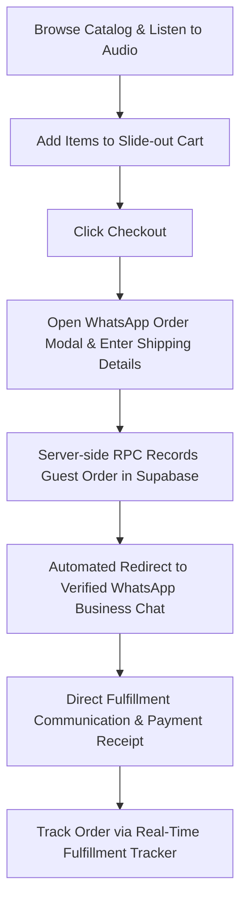
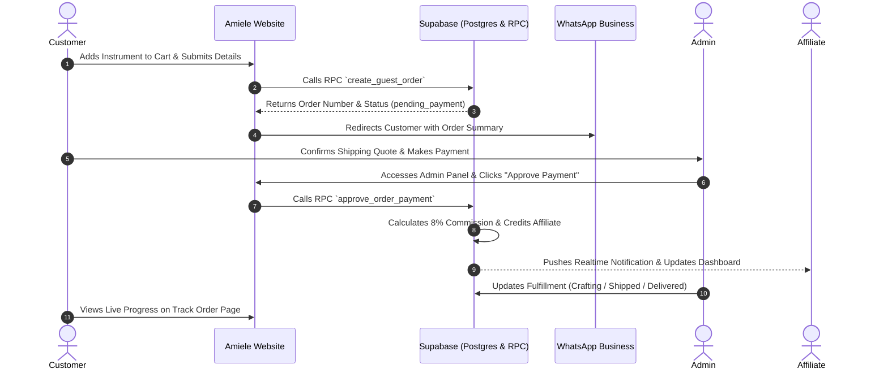

# Amiele Begena (ዓሚኤል በገና)

[](https://amielestore-web.vercel.app/)
[](https://supabase.com)
[](https://github.com/nibowkira/amielebegena-web)
[](https://amielestore-web.vercel.app/)

> **Preserving sacred acoustic heritage and ancient Ethiopian craftsmanship through a curated digital storefront and global partner ecosystem.**

Amiele Begena (ዓሚኤል በገና) is a bespoke cultural e-commerce platform and digital archive dedicated to traditional, handcrafted Ethiopian musical instruments. Based in Addis Ababa, Ethiopia, Amiele Begena bridges centuries-old artisan instrument-making traditions with global musicians, collectors, and cultural enthusiasts through high-fidelity digital storytelling, multi-currency commerce, and secure referral tracking.

---

## 🌍 Live Website

Explore the production platform:
🔗 **[https://amielestore-web.vercel.app](https://amielestore-web.vercel.app/)**

---

## ✨ About the Project

Traditional Ethiopian musical instruments carry millennia of liturgical, royal, and folk musical heritage. From the meditative, ten-stringed *Begena* (often referred to historically as the "Harp of King David") to the vibrant *Kirar* lyre and the single-stringed horsehair *Masinko*, each piece in the Amiele collection is handcrafted by master artisans in Ethiopia using native hardwoods, parchment resonant skins, and traditional tension tuning systems.

**Amiele Begena** was created to:
- **Celebrate Sacred Heritage:** Provide deep historical context, organology, and audio samples of rare Ethiopian instruments.
- **Support Master Artisans:** Create a direct, fair marketplace connecting local Ethiopian craftsmen with domestic and international buyers.
- **Ensure Authentic Global Delivery:** Combine modern web architecture with personalized customer care and worldwide shipping from Addis Ababa.

---

## 🎵 Products & Cultural Experience

The platform offers a curated catalog of authentic instruments, accessories, and educational resources:

* **Sacred String Instruments:**
  * **በገና (Begena):** 10-string ceremonial harp tuned to ancient Ethiopian pentatonic modes (*Tizita*, *Bati*, *Ambassel*, *Anchi Hoye*).
  * **ክራር (Kirar):** Traditional 6-string bowl lyre available in acoustic hardwood and modern electric variations.
  * **ማሲንቆ (Masinko):** Diamond-shaped, single-stringed bowed lute with horsehair bow and goatskin soundbox.
* **Percussion & Wind Instruments:**
  * **ከበሮ (Kebero):** Double-headed ceremonial and liturgical drum.
  * **ዋሽንት (Washint):** End-blown mountain bamboo flute.
  * **ጸናጽል (Sanasel):** Liturgical brass sistrum used in Ethiopian Orthodox Tewahedo hymnology.
  * **መለከት (Meleket):** Ancient royal ceremony long-horn trumpet.
* **Archival Accessories & Literature:**
  * Hand-stitched Ethiopian leather carry bags, handwoven cotton tote bags with traditional *Tibeb* patterns, replacement strings (*Awtar*), highland conditioning beeswax, and instructional literature.
* **Interactive Audio Previews:**
  * Integrated acoustic sound players allow visitors to listen to studio recordings of authentic instruments directly from the catalog.
* **Comprehensive Cultural Blog:**
  * In-depth scholarly articles documenting instrument history, acoustic physics, sacred Orthodox worship roles, and instrument maintenance guides under `/blog/`.

---

## 🛒 Customer Experience

The customer shopping journey combines digital precision with human-assisted verification:



1. **Catalog Exploration:** Browse categorized items, switch between currencies (**ETB**, **USD**, **EUR**) with live exchange rates, and audition instrument sound recordings.
2. **Slide-Out Cart:** Real-time quantity adjustments, price calculations, and persistent wishlist bookmarks.
3. **Structured Order Modal:** Captures customer name, phone number, email address, delivery country, and special notes.
4. **Database-First Order Registration:** Before dispatching to WhatsApp, the order payload is committed to Supabase via the `create_guest_order` stored procedure, capturing affiliate attribution and generating a unique order tracking number.
5. **WhatsApp Concierge Checkout:** The customer is forwarded to official WhatsApp business lines (`+251 969 189 470`) with pre-composed order metadata for customized shipping quotes and fulfillment updates.
6. **Order Tracking (`track-order.html`):** Customers enter their order number and contact details to view stage-by-stage progression (Pending, Payment Verified, Crafting, Packed, Shipped, Delivered) queried from `order_fulfillment_history`.

---

## 🤝 Affiliate Program

Amiele Begena features a partner network designed for cultural ambassadors, musicians, and creators:

* **Application Workflow (`affiliate-apply.html`):** Prospective partners submit their profile, promotional channels, target audience details, and preferred withdrawal method (Telebirr, Commercial Bank of Ethiopia (CBE), or PayPal/Wire).
* **Flat 8% Commission:** Approved affiliates earn a verified 8% commission on referred sales.
* **Referral Attribution & Click Tracking:** Referral codes (e.g., `?ref=CODE`) are captured on arrival, persisted in browser storage, and automatically linked to order submissions.
* **Affiliate Dashboard (`affiliate-dashboard.html`):**
  * Real-time metrics for total clicks, conversions, pending commissions, and total earnings.
  * Interactive Commission Ledger with order attribution logs.
  * Direct withdrawal requests with automated balance deductions and status tracking.
  * Campaign link generators and promotional banners.
* **Realtime Synchronization:** Supabase Realtime channels push instant updates to the affiliate dashboard when orders are attributed or commissions are verified.

---

## 👨‍💼 Admin System

The executive dashboard (`admin.html`) provides administrators with comprehensive store control:

* **Executive Analytics:** Live revenue metrics, monthly growth figures, conversion rates, and regional order distributions.
* **Order & Payment Verification:** Review incoming guest orders, inspect customer contact details, and approve/reject payments.
* **Idempotent Commission Payout Engine:** Approving an order payment executes the `approve_order_payment` database function, calculating and allocating affiliate commissions while strictly preventing duplicate payouts.
* **Product Management Subsystem (PMS):** Complete CRUD interface for managing product names, descriptions, categories, stock, USD/ETB base prices, and media assets.
* **Fulfillment History Manager:** Update shipping stages and log tracking numbers for customer visibility.
* **Affiliate Application Review:** Review, approve, or decline affiliate applications with automated role promotion in `profiles`.

---

## 🔐 Security Architecture

The platform implements multi-tier security standards:

* **Row Level Security (RLS):** All Postgres tables enforce granular RLS policies ensuring users only access their own profile data, orders, and commissions, while product catalogs remain public-read.
* **Role-Based Access Control (RBAC):** Roles (`user`, `affiliate`, `admin`) are strictly enforced via the `get_user_role()` database security definer function and verified client-side via `auth-guard.js`.
* **Zero Frontend Secret Exposure:** The client-facing application utilizes exclusively the public `anon` key. No `service_role` or sensitive environment secrets exist in the codebase.
* **SECURITY DEFINER Stored Procedures:** Sensitive operations (such as guest order creation, order tracking lookups, and payment/commission calculations) are encapsulated within PostgreSQL RPC functions with explicit parameter validation and sanitized search paths.
* **Anti-Fraud Protections:**
  * Self-approval and duplicate commission guards built into the database layer.
  * Safe client-side HTML sanitization (`AmieleSanitize.escapeHtml`) across all dynamic template injections.
* **Content Security Policy & HTTP Headers:** Configured via `vercel.json` with strict HSTS, `X-Frame-Options: DENY`, `X-Content-Type-Options: nosniff`, and whitelisted script/connect origins.

---

## 🏗️ Technology Stack

| Layer | Technologies |
| :--- | :--- |
| **Frontend UI** | Semantic HTML5, Vanilla CSS3 (Custom Design System, Glassmorphism, Benaiah Typography), Modern Vanilla JavaScript (ES6+) |
| **Icons & Fonts** | Font Awesome 6, Cormorant Garamond & Outfit (Google Fonts), Custom *Benaiah* Typeface |
| **Backend & Database** | [Supabase](https://supabase.com/) (PostgreSQL 15, Auth, Row Level Security, Realtime, Storage Buckets) |
| **Business Logic** | PostgreSQL Stored Procedures (PL/pgSQL RPCs), Database Triggers, and Constraints |
| **APIs & Integrations** | Supabase JS SDK v2, Open Exchange Rates API (`open.er-api.com`), WhatsApp Click-to-Chat API |
| **Hosting & Edge** | [Vercel](https://vercel.com/) (Clean URLs, Global Edge Routing, Custom Security Headers & Immutable Asset Caching) |

---

## 🗄️ Database Architecture

The data tier is structured across normalized PostgreSQL tables with automated triggers:

### Core Tables
* `profiles` — Extends `auth.users` with names, contact information, user roles (`user`, `affiliate`, `admin`), and active flags.
* `products` — Archival instrument catalog with descriptions, categories, pricing, stock levels, and audio preview URLs.
* `product_images` — Storage paths and cover image mappings.
* `orders` — Customer order records with product mapping, quantity, country, customer contact, payment status, and affiliate linkage.
* `order_fulfillment_history` — Sequential timeline checkpoints for the customer tracking engine.
* `affiliates` — Registered partner referral codes, total sales counters, and earnings balances.
* `affiliate_applications` — Partner intake submissions and administrative review status.
* `affiliate_clicks` — IP and User-Agent telemetry for affiliate conversion tracking.
* `commissions` — Transactional commission ledger linked to approved orders.
* `affiliate_withdrawals` — Partner payout disbursement requests.
* `notifications` — Role-scoped notification delivery.

### Key Database Functions (RPCs)
* `create_guest_order(...)` — Safely registers guest checkouts, maps product identifiers, and links referral attribution without requiring customer account pre-registration.
* `track_guest_order(...)` — Validates order number against verified customer contact details and returns active fulfillment timeline data.
* `approve_order_payment(...)` — Server-side transaction that transitions order status to verified, calculates exact commission percentages, and credits the referrer's balance idempotently.
* `repair_missing_commissions()` — Maintenance RPC to backfill attribution across legacy transactions.

---

## 🔄 Order & Commission Flow



---

## 📱 Responsive Design & Aesthetics

* **Curated Visual Identity:** Handcrafted luxury Ethiopian aesthetic utilizing rich forest green (`#14231b`), warm parchment backgrounds (`#f9f8f4`), and refined gold leaf highlights (`#D4AF37`).
* **Fluid Layouts:** Fully responsive CSS Grid and Flexbox architecture tailored for desktop displays, tablets, and mobile devices down to 320px viewport widths.
* **Touch-Friendly Controls:** Mobile drawer navigation with backdrop blur, swipe-enabled testimonial carousel, and non-intrusive floating WhatsApp assistance widget.

---

## 🔎 Search Engine Optimization (SEO)

* **Semantic HTML5:** Structured heading hierarchy (`h1` through `h6`) across all catalog and blog views.
* **Open Graph & Twitter Cards:** Complete social preview metadata with optimized 1200x630 share graphics.
* **Structured Data (JSON-LD):** Schema.org schemas configured for `Organization`, `WebSite` (with search action), and `LocalBusiness`.
* **Sitemap & Robots Configuration:** Comprehensive `sitemap.xml` detailing all core routes and blog posts; `robots.txt` protecting administrative portals while allowing search crawler indexing.

---

## 📁 Project Structure

```
amielebegena-web/
├── blog/                         # Cultural history & instrument guides
│   ├── begena-vs-kirar.html
│   ├── history-of-the-begena.html
│   └── what-is-the-begena.html
├── audio/                        # High-fidelity instrument acoustic audio clips
├── image/                        # Handcrafted photography and catalog assets
├── js/                           # Modular client services & utilities
│   ├── admin-service.js          # Admin dashboard analytics & order management
│   ├── affiliate-service.js      # Referral tracking & partner dashboard engine
│   ├── auth.js                   # Supabase authentication & user profile management
│   ├── auth-guard.js             # Route protection & return destination persistence
│   ├── notifications-service.js  # Realtime notification engine
│   ├── orders-service.js         # Guest order creation & tracking RPC interfaces
│   ├── pms-service.js            # Product Management System service
│   ├── products-service.js       # Dynamic product catalog loader
│   ├── supabase-client.js        # Supabase client factory & initialization
│   └── utils/
│       └── sanitize.js           # HTML escaping & XSS sanitization
├── supabase/
│   └── migrations/               # Comprehensive SQL schema, triggers & RLS migrations
├── index.html                    # Storefront landing page & hero experience
├── products.html                 # Full instrument catalog with filters & audio players
├── about.html                    # Organology & instrument anatomy breakdown
├── about-us.html                 # Brand story, workshop history & artisans
├── track-order.html              # Real-time order fulfillment tracker
├── affiliate.html                # Affiliate program landing & benefits
├── affiliate-apply.html          # Partner registration intake form
├── affiliate-dashboard.html      # Real-time partner earnings & referral hub
├── admin.html                    # Executive management & payment approval portal
├── login.html                    # Unified customer & partner authentication
├── account.html                  # Customer profile, saved items & order history
├── shipping.html                 # Worldwide delivery information & customs policy
├── sustainability.html           # Ethical sourcing & hardwood replanting mission
├── contact.html                  # Workshop location, direct lines & inquiries
├── vercel.json                   # Edge routing, headers, CSP & asset caching
├── sitemap.xml                   # XML Sitemap for search engines
├── robots.txt                    # Search crawler rules & route protection
└── package.json                  # Project tooling & dependency definitions
```

---

## 🚀 Local Development

The project is built with standard web technologies and requires no complex build compilation.

### Prerequisites
- Node.js (optional, for local development servers) or any static HTTP server (Python, VS Code Live Server, Caddy, etc.)
- A Supabase project with executed migrations from `supabase/migrations/`

### Running Locally

1. **Clone the repository:**
   ```bash
   git clone https://github.com/nibowkira/amielebegena-web.git
   cd amielebegena-web
   ```

2. **Serve using a local HTTP server:**

   Using Python:
   ```bash
   python -m http.server 8000
   ```

   Using Node (`npx serve`):
   ```bash
   npx serve .
   ```

3. **Open in your browser:**
   Navigate to `http://localhost:8000` (or the port specified by your local server).

---

## 🔧 Environment & Configuration

Client connection parameters to Supabase are configured in `js/supabase-client.js`:
- `SUPABASE_URL` — Public Supabase project endpoint
- `SUPABASE_ANON_KEY` — Public anonymous client key (protected by PostgreSQL Row Level Security)

> 🔒 **Security Notice:** Administrative privileges and secret keys (`SUPABASE_SERVICE_ROLE_KEY`) are **never** bundled in frontend files. All administrative data operations require an authenticated session possessing the `admin` role in `public.profiles`.

---

## 🚢 Deployment

The production website is continuously deployed on **Vercel**:
- Every push to the `main` branch automatically triggers a production deployment.
- Edge routing rules, clean URLs (`cleanUrls: true`), fallback handlers (`error.html`), and custom HTTP security headers are governed by `vercel.json`.

---

## 🧪 Testing & Quality Assurance

The codebase has undergone system audits verifying:
- **Syntax Validation:** All client JavaScript modules validated with `node --check`.
- **Database & RLS Integrity:** Migration scripts verified for non-recursive role checking and atomic transaction safety.
- **Idempotency Verification:** Stored procedures tested against duplicate order approvals and double-crediting scenarios.
- **Header & CSP Conformance:** Vercel edge headers verified against modern security policies.

---

## 🛡️ Production Status

* **Status:** **Live & Operational**
* **Deployment URL:** [https://amielestore-web.vercel.app](https://amielestore-web.vercel.app)
* **Order Processing:** Active via WhatsApp direct fulfillment.

---

## 📌 Architecture Considerations & Known Characteristics

* **Concierge WhatsApp Fulfillment:** Order submission records transactions in PostgreSQL and immediately connects the buyer with an Ethiopian fulfillment coordinator via WhatsApp to verify shipping destinations, arrange custom carrier options (DHL, Ethiopian Airlines Cargo), and confirm local or international payment methods.
* **Currency Rates:** Live foreign exchange conversion relies on `open.er-api.com` with hardcoded fallback safety margins in `script.js` to guarantee consistent pricing during network disruptions.

---

## 🗺️ Roadmap & Future Enhancements

- [ ] Direct automated payment gateway integration (Telebirr SuperApp SDK, Chapa, Stripe) alongside WhatsApp concierge checkout.
- [ ] Automated transactional email notifications for order progress updates.
- [ ] PDF certificate of authenticity generator for rare archival instruments.
- [ ] Interactive 3D instrument visualizer and soundboard tuner.

---

## 🤍 Cultural Mission

Amiele Begena exists not merely as a storefront, but as a living bridge to Ethiopian musical traditions. By honoring the spiritual reverence of the *Begena*, the joyful resonance of the *Kirar*, and the soulful voice of the *Masinko*, we are dedicated to sustaining master craftsman workshops in Addis Ababa and passing this heritage forward to the world.

---

## 📄 License

License: Not currently specified. All intellectual property, instrument photography, sound recordings, and brand assets are reserved by Amiele Begena.

---

## 🙏 Acknowledgements

- Master luthiers and instrument craftsmen across Addis Ababa and Ethiopia.
- The global Ethiopian diaspora and musicological community dedicated to preserving ancient traditional music.
- Open-source communities supporting Supabase, PostgreSQL, and modern web standards.
